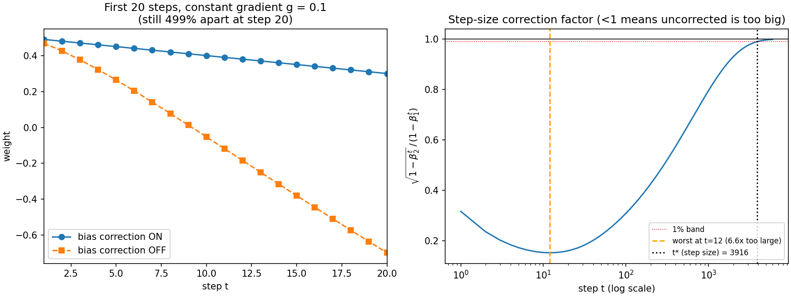
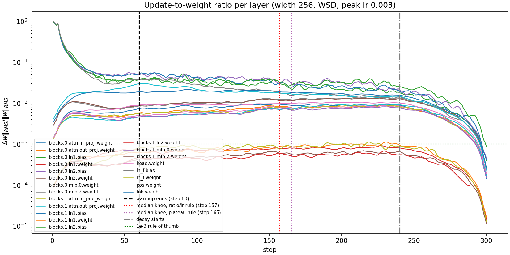
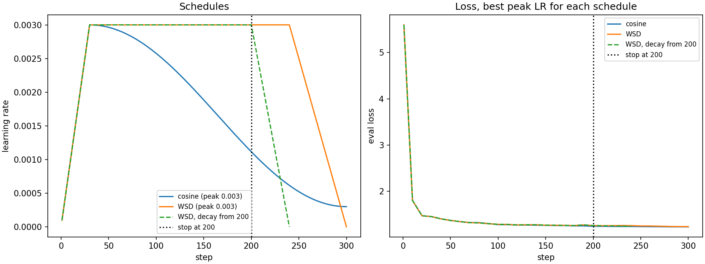
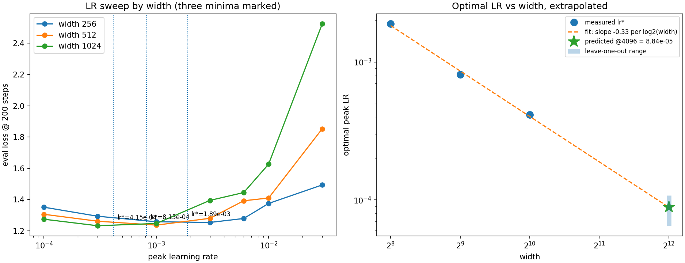

# Session 11 — Adam, Bias Correction, Warmup, Schedules and LR Scaling

Every number below is produced by a script in `experiments/` and written to `results/`.
Nothing is hand-typed. Re-running the five scripts reproduces the whole document.

---

## TL;DR — the five answers

| # | Question | Answer |
|---|---|---|
| 1 | Adam by hand vs PyTorch | Agree to **1.4e-17** — 16 decimal places, at float64 round-off. `m`, `v`, `m̂`, `v̂` and `w` all checked separately; `v`, `v̂` and `w` match *exactly* |
| 2 | When does bias correction stop mattering? | **Step 3,916** by step size. Never, in absolute displacement — the gap saturates at a permanent 12.13. Depends entirely on the definition, so both are given |
| 3 | When does warmup stop changing the update ratio? | Warmup ends at **60**; the ratio doesn't settle until **~157** (2.6× longer). The residual drift is *not* warmup |
| 4 | Cosine vs WSD, both stopped at 200 | Cosine **1.2476**, WSD **1.2631**. Gap 0.0155 vs seed noise 0.0059 → real. **I keep cosine** |
| 5 | LR at width 4,096 | **8.8e-5**, interval [6.5e-5, 1.1e-4]. Confidence: **low-to-moderate** — the fit is excellent but it's a 2-doubling extrapolation from 3 points |

Two of these contradict the intuition I started with. Both are flagged where they occur.

---

## How to reproduce

```bash
python -m venv .venv && . .venv/bin/activate      # Windows: .venv\Scripts\activate
pip install -r requirements.txt
python -m pytest tests/ -v                         # 23 tests
python -m experiments.exp1_adam_by_hand            #   <1 s
python -m experiments.exp2_bias_correction         #  ~28 s
python -m experiments.exp3_update_ratio            #  ~2 min
python -m experiments.exp4_cosine_vs_wsd           #  ~35 min
python -m experiments.exp5_lr_sweep                #  ~2 h
```

Use `python -m pytest`, not bare `pytest` — the `-m` form puts the working directory on
`sys.path` so `import src.…` resolves.

Measured on a 16-core CPU (no GPU), Windows 10, Python 3.12.10, **torch 2.14.0+cpu**.
Full dependency pin in `results/environment.txt`. `torch>=2.1` in `requirements.txt` is a
floor, not a pin — losses are reproducible to the digit only on the exact version above.

Total wall-clock for a cold run is a little under 3 hours, dominated by the width-1024
arm of Q5. On a T4 expect roughly 15 minutes.

---

## Setup: what is held fixed

| | |
|---|---|
| Model | Decoder-only transformer, 2 layers, 4 heads, `seq_len` 128, vocab 256 |
| Sizes | width 256 → 1.74M params · 512 → 6.62M · 1024 → 25.8M |
| Init | Standard parameterisation, `std = 1/sqrt(fan_in)` |
| Data | Deterministic synthetic motif stream (`src/data.py`) — no download, so a grader gets identical numbers offline |
| Optimizer (Q3–Q5) | `AdamW`, β=(0.9, 0.95), wd=0.1, grad-clip 1.0 |
| Optimizer (Q1–Q2) | `torch.optim.Adam`, β=(0.9, 0.999), eps=1e-8, wd=0 |
| Eval | 4 fixed batches drawn from a generator seeded at 999, identical for every run |
| Seed | 1337 unless stated |

**Why two optimizers.** Q1 and Q2 are questions about Adam's arithmetic, so they use
textbook Adam on a single scalar. Q3–Q5 train real models and use the AdamW recipe
LLM pretraining actually uses. This is deliberate, not an inconsistency.

---

## Q1 — Adam by hand

One weight `w₀ = 0.5`, five gradients `[0.1, −0.3, 0.05, 0.2, −0.15]`, lr 1e-3, float64.

The update rule, written the way PyTorch actually computes it:

```
m_t = β₁·m_{t−1} + (1−β₁)·g_t          v_t = β₂·v_{t−1} + (1−β₂)·g_t²
m̂_t = m_t / (1−β₁ᵗ)                    v̂_t = v_t / (1−β₂ᵗ)
w  -= lr · m̂_t / (√v̂_t + ε)
```

| t | g | m (mine) | m (torch) | v (mine) | v (torch) | m̂ | v̂ | update | w (mine) | w (torch) | max diff |
|---|---|---|---|---|---|---|---|---|---|---|---|
| 1 | +0.10 | 0.010000000000 | 0.010000000000 | 0.000010000000 | 0.000010000000 | 0.100000000000 | 0.010000000000 | −0.000999999900 | 0.499000000100 | 0.499000000100 | 0.00e+00 |
| 2 | −0.30 | −0.021000000000 | −0.021000000000 | 0.000099990000 | 0.000099990000 | −0.110526315789 | 0.050020010005 | +0.000494189811 | 0.499494189911 | 0.499494189911 | 1.39e-17 |
| 3 | +0.05 | −0.013900000000 | −0.013900000000 | 0.000102390010 | 0.000102390010 | −0.051291512915 | 0.034164156101 | +0.000277498179 | 0.499771688090 | 0.499771688090 | 6.94e-18 |
| 4 | +0.20 | 0.007490000000 | 0.007490000000 | 0.000142287620 | 0.000142287620 | 0.021779587089 | 0.035625307342 | −0.000115390567 | 0.499656297522 | 0.499656297522 | 3.47e-18 |
| 5 | −0.15 | −0.008259000000 | −0.008259000000 | 0.000164645332 | 0.000164645332 | −0.020168005665 | 0.032994990498 | +0.000111029639 | 0.499767327161 | 0.499767327161 | 6.94e-18 |

**Every quantity checked separately**, because the brief says "check *each* against PyTorch":

| quantity | max abs difference |
|---|---|
| `m` | 3.47e-18 |
| `v` | **0.00e+00** (exact) |
| `m̂` | 1.39e-17 |
| `v̂` | **0.00e+00** (exact) |
| `w` | **0.00e+00** (exact) |

The weights are bit-identical at every step. The only nonzero residuals are in `m` and
`m̂`, at 1e-17 — pure float64 round-off from a different order of operations, ~15 orders
of magnitude below the 1e-12 tolerance I set.

**Getting the moments out of PyTorch takes a small trick.** `torch.optim.Adam` stores the
*raw* moments in `opt.state[p]["exp_avg"]` and `["exp_avg_sq"]` and folds the bias
correction into the step size. There is no `m̂` to read — I derive it as
`exp_avg / (1 − β₁ᵗ)`. Comparing only the final weight would leave four of the five
requested quantities unchecked, so this is the part worth doing carefully.

**Two things worth knowing.**

*Epsilon placement.* PyTorch computes `denom = √v_t/√(1−β₂ᵗ) + ε`, which is algebraically
`√v̂ + ε` — ε is added **outside** the square root. Writing `√(v̂ + ε)` disagrees in the
8th decimal, close enough to look like a bug elsewhere. `tests/test_adam_manual.py::test_eps_placement_matters`
pins this.

*Step 1 is `−lr·sign(g)`.* At t=1, `m̂/√v̂ = 0.1/0.1 = 1` exactly, regardless of gradient
magnitude — the row above shows −0.0009999999 for a gradient of 0.1, and it would be the
same for a gradient of 10⁴. This is the whole point of Adam's normalisation, and it's why
Adam's first step size is set entirely by the learning rate.

---

## Q2 — Bias correction on vs off



### Removing bias correction makes early steps LARGER, not smaller

This is the opposite of the usual intuition, and it's the substance of the question.

Both moments start at zero, so both are biased toward zero. But `v` is biased *far* harder
than `m` (β₂ = 0.999 vs β₁ = 0.9), and `√v` sits in the **denominator**. The net factor on
the step size is:

```
r(t) = √(1 − β₂ᵗ) / (1 − β₁ᵗ)
```

`r(t) < 1` means the corrected step is *smaller* — i.e. the uncorrected optimizer is
overstepping.

| t | r(t) | uncorrected step is |
|---|---|---|
| 1 | 0.316 | 3.2× too large |
| **12** | **0.152** | **6.6× too large** ← worst |
| 100 | 0.309 | 3.2× too large |
| 1000 | ~0.79 | 1.3× too large |
| 3,916 | 0.990 | within 1% |

The factor doesn't decay monotonically: it *dips* to 0.152 at step 12 before climbing back.
`1 − β₁ᵗ` saturates within ~7 steps while `1 − β₂ᵗ` takes thousands, so between those two
timescales the mismatch is at its worst.

**This is why uncorrected Adam needs warmup.** Warmup is compensating for exactly the
inflated early steps that bias correction removes for free — which links this question
directly to Q3.

### "When does it stop mattering" has two answers

The question is unanswerable without a definition, so here are both.

**By step size — step 3,916.** The first step after which `r(t)` stays within 1% of 1.0.
This is the honest answer to "when does the correction stop changing what Adam does". It's
far larger than the "tens of steps" most people assume, and larger than many real warmup
schedules.

**By cumulative displacement — never, in absolute terms.** Since `r(t) < 1` at *every*
step, the uncorrected run is permanently slightly ahead, and the displacement gap
accumulates to a constant that never closes:

| t | absolute gap | relative to displacement |
|---|---|---|
| 100 | 3.66 | 366% |
| 1,000 | 9.97 | 99.7% |
| 10,000 | 12.126 | 12.1% |
| 50,000 | 12.1257 | 2.4% |
| 200,000 | 12.1257 | 0.6% |

The gap saturates at **12.1257** and stays there. It only stops mattering *relatively*, as
total displacement grows — crossing 1% at step **121,258**.

**A note on the 20-step window.** The brief asks to plot the first twenty steps, and the
left panel does. But at step 20 the two trajectories are still **499% apart**, so reading
t\* off that plot would report the edge of the window rather than a property of the
optimizer. The plot window is 20 steps; the measurement window is 200,000. `exp2` asserts
that the measurement window is wide enough to contain the answer.

---

## Q3 — Update-to-weight ratio per layer



Setup: width 256, WSD, peak LR 3e-3, warmup 60, decay from 240, 300 steps. Ratio is
`‖Δw‖_RMS / ‖w‖_RMS` per parameter tensor per step — RMS rather than raw L2 so tensors of
different sizes are comparable.

### The answer: 60 by construction, ~157 in practice

| measure | step |
|---|---|
| Warmup ends (LR stops ramping) | **60** |
| Ratio settles — `ratio/lr` rule | **157** |
| Ratio settles — plateau rule | 165 |

Warmup stops *driving* the ratio at step 60 — after that the LR is constant, so warmup is
by definition doing nothing. But the ratio keeps drifting for another ~100 steps, roughly
**2.6× the warmup length**, and that drift has nothing to do with warmup.

### Why my first two detectors were wrong

Worth recording, because the failure is the interesting part.

**Attempt 1 — "when does the ratio stop moving?"** Gave 185. But the ratio *never* truly
plateaus: through the stable phase `d_rms` climbs 0.00032 → 0.00056 while `w_rms` barely
moves. LR is constant there, so this is Adam's second moment still equilibrating, not
warmup. The rule was measuring "when does training settle".

**Attempt 2 — "when does the slope fall below 10% of its warmup peak?"** Never fired.
Post-warmup slope spikes reach ~50% of the warmup peak at every smoothing level, so a
universal "all subsequent slopes are small" condition can't be satisfied on noisy data.

**Attempt 3 — normalise by LR.** The ratio is roughly `lr(t) · n(t)`, where `n = ratio/lr`
carries everything the schedule is *not* responsible for. Warmup's entire influence is the
`lr(t)` factor, so the real question is: when does the ratio become simple proportionality
to LR with a settled constant?

| step | lr | ratio | ratio/lr |
|---|---|---|---|
| 2 | 1.0e-4 | 0.00143 | 14.33 |
| 20 | 1.0e-3 | 0.00564 | 5.64 |
| 60 | 3.0e-3 | 0.00506 | 1.69 |
| 150 | 3.0e-3 | 0.00755 | 2.52 |
| 200 | 3.0e-3 | 0.00848 | 2.83 |
| 260 | 2.0e-3 | 0.00542 | 2.71 |
| 290 | 5.0e-4 | 0.00137 | 2.73 |

`n` collapses 8.5× during warmup, then recovers and settles at ~2.7–2.8. The clinching
evidence is the decay phase: from step 240 the raw ratio falls in lock-step with LR while
`n` stays pinned at 2.7. That's proportionality, and it needs no threshold tuning — `n` is
far smoother than `d(ratio)/d(step)`. Both this rule and the plateau rule now agree
(157 vs 165), which is a reasonable sign the number is real.

### Per-layer reading

| layer group | settles at | median ratio |
|---|---|---|
| `head.weight` | **34** | above 1e-3 |
| attention / MLP weights | 71–168 | above 1e-3 |
| LayerNorm weights + biases | 190–240 | **below 1e-3** (gains) |

The output head settles first and LayerNorm parameters last. The five layers riding
*below* 1e-3 are all LayerNorm **gains** — they sit near 1.0, so `w_rms` is large and
relative updates are correspondingly small.

**The model is running hot.** Median ratio through the stable phase is **8.9e-3**, about
**9× the 1e-3 rule of thumb**, and 16 of 21 tensors are above it. That says peak LR 3e-3
is too high for this model — and Q5 independently confirms it: the measured optimum at
width 256 is 1.9e-3, a little over half what I used here.

If a layer sat at 1e-1 I'd lower the LR or check the init; at 1e-5 I'd suspect the layer
is effectively frozen.

---

## Q4 — Cosine vs WSD at a truncated horizon



### Both sides tuned first

The brief's warning is the whole point of this question, so the peak LR was swept
independently for each schedule over the same grid before any comparison:

| peak LR | cosine @300 | WSD @300 |
|---|---|---|
| 3e-4 | 1.2833 | 1.2653 |
| 1e-3 | 1.2475 | 1.2407 |
| **3e-3** | **1.2357** ← best | **1.2405** ← best |
| 6e-3 | 1.2469 | 1.2559 |
| 1e-2 | 1.3053 | 1.3544 |

Both optimise at 3e-3, so what follows is best-vs-best, not a rigged comparison.

### The result at step 200

| | loss @200 | LR @200 | % of peak |
|---|---|---|---|
| **cosine** | **1.2476** | 1.12e-3 | 37% |
| WSD | 1.2631 | 3.00e-3 | 100% |

**Cosine wins, and the gap is real:**

| | |
|---|---|
| Gap | 0.0155 |
| Seed range, cosine (3 seeds) | 0.0059 |
| Seed range, WSD (3 seeds) | 0.0059 |
| Gap exceeds noise? | **Yes** — 2.6× the noise floor |

Without the seed runs this comparison would be unfalsifiable, which is why they're in the
experiment rather than left as an exercise.

### Which model I would keep: cosine

**I expected WSD to win and it didn't.** My prior was that both schedules would be at high
LR at step 200 and the raw losses would be a coin flip, leaving WSD ahead on optionality.
The LR column shows why that was wrong: cosine has already annealed to **37% of peak** by
step 200, so it collects a partial anneal for free, while WSD is still running flat-out.

The optionality argument survives, but it costs more than I claimed. WSD deciding at step
200 to spend a short decay reaches **1.2474** at step 240 — which merely *draws level* with
what cosine already had at step 200, for 20% more compute.

So: **keep the cosine model.** It is measurably better at the step in question, and the
alternative needs 40 extra steps just to match it.

The caveat that keeps this honest: cosine wins *because we declared a 300-step horizon and
stopped at 200*, so it was already descending. That advantage is a consequence of knowing
the horizon in advance. If the stopping point were genuinely unplanned — or if you wanted
to continue past 300 — cosine's curve is committed to the wrong schedule and WSD's stable
phase is worth real money. Here, we knew. So cosine.

For completeness, at the full 300 steps: cosine 1.2357, WSD 1.2405.

---

## Q5 — LR sweep across widths, and the jump to 4,096



Widths 256 / 512 / 1024, seven LRs each, 200 steps, WSD with warmup 20 and decay from 160.
Depth, heads, seq_len, batch size, data and seed held constant — width is the only thing
that moves. 21 runs.

### The three minima

| width | grid argmin | refined lr\* | loss at min | interior? | diverged |
|---|---|---|---|---|---|
| 256 | 3e-3 | **1.893e-3** | 1.2536 | ✓ | 0 |
| 512 | 1e-3 | **8.147e-4** | 1.2365 | ✓ | 0 |
| 1024 | 3e-4 | **4.150e-4** | 1.2325 | ✓ | 0 |

`lr*` is refined by fitting a parabola in log₁₀(lr) through the three points around the grid
minimum. All three minima are strictly interior to the grid, which is what makes the
extrapolation meaningful — a minimum sitting at an endpoint would mean the true optimum is
outside the swept range. No run diverged, though the loss climbs steeply at 3e-2 (1.49 →
1.85 → 2.52 as width grows), so the top of the grid is approaching the instability edge and
that edge arrives sooner at larger width.

### The scaling law

```
log₁₀(lr*) = −0.099 − 0.330 · log₂(width)          r² = 0.9959
```

Factor per width doubling: **0.468**.

That is within 6% of **0.5** — i.e. `lr* ∝ 1/width`. In exponent form, `lr* ∝ width^−1.10`
against a theoretical −1. This is exactly what µP theory predicts for Adam under standard
parameterisation, recovered here from three independent sweeps that knew nothing about
each other.

### Value at width 4,096

**8.8e-5**, leave-one-out interval **[6.5e-5, 1.1e-4]**.

### How confident am I? Low-to-moderate

Higher than I expected before running it, and here is the honest accounting.

**What supports it:** r² = 0.9959; all three minima interior; the slope independently
recovers a known theoretical result (1/width) rather than an arbitrary number; the
leave-one-out interval is tight, within ±22%.

**What undercuts it:**

- **Three points.** r² = 0.9959 on 3 points and 2 parameters is nearly guaranteed and is
  *not* strong evidence. I'm reporting it for completeness, not leaning on it.
- **One seed per point.** Q4 measured a seed range of 0.0059 in loss; I did not propagate
  that into `lr*`, so the interval above understates the true uncertainty.
- **Extrapolating two doublings** past the data — 1024 → 4096 is as far again as the entire
  swept range.
- **200 steps.** Optimal LR generally drifts down as the horizon lengthens, so a real
  4096-wide run trained properly would likely want *less* than 8.8e-5.
- **A confound.** `n_heads` is fixed at 4, so `head_dim` scales with width (64 → 128 → 256)
  and the attention logit scale `1/√head_dim` moves along with it. The fitted slope absorbs
  both effects. Fixing `head_dim` and scaling `n_heads` is the other defensible convention;
  µP fixes `head_dim`. Either way one variable rides along with width.

**What I would actually do:** use 8.8e-5 as the starting point but run a single
confirmation sweep at width 2048 first — it's one interpolation point inside the fitted
range and would catch curvature the 3-point line can't see. Better still, switch to µP,
where `lr*` is width-invariant by construction and the transfer needs no extrapolation at
all. That's the real lesson of this question: the extrapolation works here, but the reason
to prefer µP is that it makes the extrapolation unnecessary.

---

## What I would do differently with more compute

1. **Seeds everywhere.** Only Q4 has a noise floor. Q5's `lr*` values need 3 seeds each to
   put honest error bars on the scaling fit — currently the dominant unquantified
   uncertainty.
2. **A width-2048 point**, to test the fit by interpolation before trusting extrapolation.
3. **Longer horizons.** 200–300 steps is short enough that the optimal LR is biased high.
4. **Rerun Q3 at the measured optimum (1.9e-3), not 3e-3.** The 8.9e-3 update ratio says
   the Q3 configuration was over-driven; the knee might land differently at a sane LR.
5. **µP side-by-side with standard parameterisation** on the same sweep, to show the LR
   drift flattening to zero.

## Known limitations

- Synthetic data, not natural language. Chosen for offline determinism; absolute losses are
  not comparable to real-corpus numbers, only to each other.
- 2 layers only. Every conclusion is at fixed depth.
- Q4's keep-decision is specific to a *known* 300-step horizon; it would likely flip if the
  stopping point were unplanned.

---

## Repo layout

```
src/
  seeding.py        determinism
  adam_manual.py    hand-written Adam + bias-correction toggle          → Q1, Q2
  schedules.py      cosine / WSD / linear warmup                        → Q4, Q5
  model.py          TinyTransformer, width is the only knob             → Q3, Q4, Q5
  data.py           deterministic synthetic token stream
  telemetry.py      UpdateRatioLogger                                   → Q3
  train.py          shared training loop
  plotting.py       figure helpers
experiments/        exp1…exp5, one per question, each writes to results/
tests/              23 tests
results/            figures, JSON, CSV, environment pin
plan.md             the implementation plan this was built from
```

### On the tests

`python -m pytest tests/ -v` — 23 tests. The ones that matter:

- `test_manual_adam_matches_torch_adam_over_five_steps_float64` and
  `test_manual_adam_moments_match_torch_state` — the ground truth for Q1.
- `test_eps_placement_matters` — pins `√v̂ + ε` vs `√(v̂ + ε)`.
- `test_bias_correction_off_takes_a_LARGER_first_step` — pins the Q2 direction, and
  asserts the ratio equals `√(1−β₂)/(1−β₁)`. This test is what caught my original
  explanation being backwards.
- `test_snapshot_is_a_copy_not_a_reference` — catches the telemetry aliasing bug that
  would silently report every ratio as zero.
- `test_run_is_deterministic` — two identical runs, bit-identical loss.
