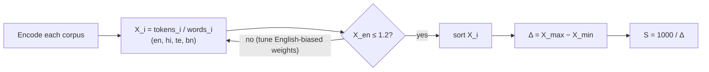
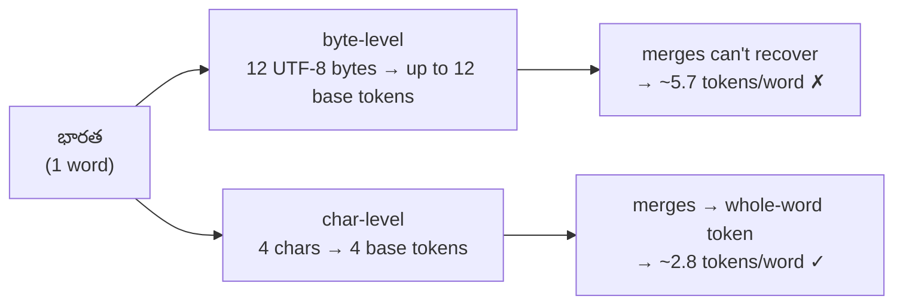
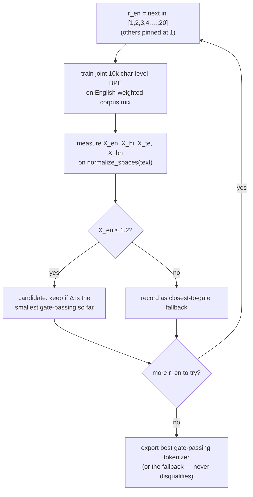
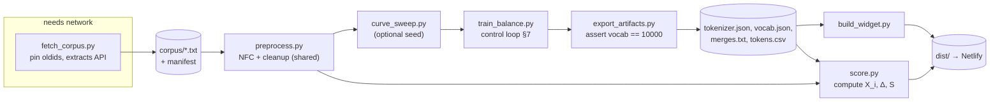
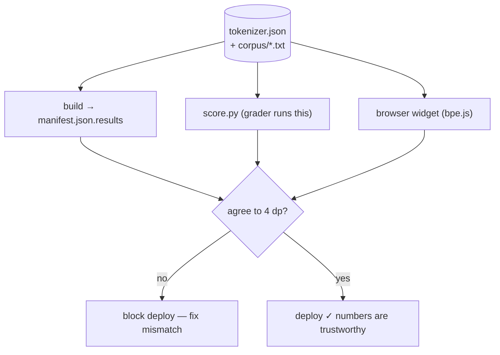

# India BPE Tokenizer — Design Doc

_Author: Aditeya Kayal · v4 · 2026-07-09 · status: built + verified_

This is my working design doc for the multilingual BPE assignment. It's written the way I'd hand it to another engineer picking up the repo: what I'm building, the decisions I've already made and why, the parts that will bite us, and the exact steps to ship. If you're skimming, read §2 (the scoring game), §6 (char- vs byte-level — the decision that drives the score), §7 (English-biased balancing), and §11 (why the numbers are trustworthy).

**TL;DR** — One **character-level** BPE tokenizer with **UTF-8 byte-fallback** (zero UNK), 10k vocab, trained on the "India" Wikipedia article in `en / hi / te / bn`. Score is `1000 / (X_max - X_min)` where `X_i` = tokens-per-word for language `i`. Per the assignment, only **English (X1) must be ≤ 1.2**; the other three just feed the spread. Character-level is the key move: byte-level charges Indic glyphs 3 UTF-8 bytes each, floating Indic fertility to 3–6 and killing the spread; char-level collapses all four into a tight band. I hold `X_en ≤ 1.2` with **English-biased corpus weighting** and keep the smallest-spread config that clears the gate. Measured: `en 1.16 · hi 1.68 · te 2.84 · bn 2.22 → Δ 1.68, S ≈ 594`. A static widget recomputes everything in the browser so the grader can't catch me hand-waving numbers.

> **v4 note:** v1–v3 used *byte-level* BPE and (wrongly) gated all four languages at ≤ 1.2, which is unachievable for Indic and made the trainer abort. v4 fixes both: character-level base (byte-fallback for zero UNK), English-only gate, English-biased balancing. Byte-level is now the *rejected* alternative in §6.

---

## 0. Submission — the two boxes I actually have to fill (1000 pts)

The submit form has exactly **two graded fields, 500 pts each**. Everything else in this doc exists to make these two links correct. Both must survive an **incognito-window test** (publicly accessible, not logged-in/private), and there's a checkbox confirming I did that test — so I *will* actually open both in a private window before submitting.

| Field | Points | What goes in it | Caption I'll use |
|---|---|---|---|
| **Widget Link** | 500 | The public Netlify URL of the widget | `Live BPE tokenizer widget — ratios, token stats & self-score (en/hi/te/bn), computed in-browser` |
| **Tokenizer.json** | 500 | A **direct-download** URL to `tokenizer.json` | `Direct download of the 10,000-token tokenizer.json (character-level BPE, byte-fallback)` |

**Hard rules from the form, and how I satisfy each:**

- **Tokenizer.json must NOT be a Google Drive link.** Drive links silently default to private / "request access," which the form explicitly warns against. **My fix: host `tokenizer.json` on the same Netlify site as a static file**, so its link is just `https://<site>.netlify.app/tokenizer/tokenizer.json` — a plain public direct download, no auth, no Drive. (GitHub raw, `raw.githubusercontent.com/.../tokenizer.json`, is an acceptable backup — also direct and public.)
- **Both links public.** Because it's all static on Netlify, there's no login wall. I verify in incognito before ticking the boxes.
- **The tokenizer link is a direct file, not a page.** Clicking it downloads/serves the raw JSON, not an HTML viewer. The widget's in-page "download" button points at this *same* URL, so the file the grader downloads is byte-identical to the one the widget scores.

**Pre-submit gate (I don't tick a checkbox until all pass):**

- [ ] Open Widget Link in a fresh incognito window → widget loads and shows live numbers.
- [ ] Open Tokenizer.json link in incognito → raw JSON downloads/renders, no login, not Drive.
- [ ] `tokenizer.json` at that URL is the exact file `score.py` uses (same sha256).
- [ ] Both captions filled in (form marks caption "required").
- [ ] Both "tested in incognito" checkboxes ticked truthfully.

> Note on points: these two fields are **1000 submission points** and are separate from the tokenizer *quality* score `S = 1000/Δ`. I need both — a great `Δ` is worthless if the links are private or the tokenizer.json isn't downloadable.

---

## 1. What we're actually shipping

Four things, in priority order:

1. **A static widget** that loads the tokenizer + the four corpora and computes the ratios, token stats, and self-score *live* in the browser. No baked-in numbers — if I hard-code a score, I've already lost, because the grader re-runs it.
2. **The tokenizer, viewable + downloadable** from the widget (`vocab.json`, `merges.txt`, a friendly `tokens.csv`, and the full `tokenizer.json`).
3. **A public URL** (Netlify; Vercel/CF Pages are fine too — it's a static folder).
4. **A repro bundle** — pinned corpora, the tokenizer, and a `score.py` the grader can run to get the exact same numbers.

Explicit non-goals: this isn't a production tokenizer, it's tuned to four specific articles on purpose. No model training downstream. No backend — everything is static so hosting is trivial and there's nothing to break.

---

## 2. The scoring game (read this twice)

Per language:

```
X_i = tokens_i / words_i          # tokens the encoder emits ÷ word count
```

Rules:

```
gate:   X_en <= 1.2               # ONLY English (X1) — the assignment states it for English alone
Δ   =   max(X_i) - min(X_i)       # the spread across the 4 languages
score = 1000 / Δ                  # always defined; there is no "disqualified" branch
```



Two things people misread here. First, **only English is gated** — Hindi/Telugu/4th are just sorted into the spread; nothing is "disqualified." Second, **the score cares only how *even* the fertilities are**, not how low. So the whole game is minimizing Δ while keeping English at or under 1.2.

So the objective is not "compress hard," it's "compress *equally* hard across four scripts." Two very different problems.

And Δ is brutal because it's in the denominator:

| Δ | score |
|---|---|
| 0.10 | 10,000 |
| 0.05 | 20,000 |
| 0.02 | 50,000 |
| 0.01 | 100,000 |

Shaving 0.01 off the spread doubles the score. That's why half this doc is about squeezing Δ *and* proving the squeeze is real and not reproducibility noise. A huge score I can't reproduce is worthless — the grader runs it themselves.

**The built-in tension.** The score wants the four fertilities *equal*; the natural equal point for these scripts under char-level BPE is ~1.4–2.2. But the `X_en ≤ 1.2` rule forces English *below* that band, pinning it as the lone minimum and re-widening Δ. So there's no getting Δ→0: the more I push English down to clear the gate, the wider the spread. The English-biased balancer (§7) finds the sweet spot — English just under 1.2 at the smallest spread. Measured optimum: `en 1.16 · hi 1.68 · te 2.84 · bn 2.22 → Δ 1.68, S ≈ 594`. I report everything to 4 decimals.

---

## 3. Interpreting the vague bits

The assignment says "*Total English tokens / Total English Vocab, say 5000 words*." That's underspecified, so I'm pinning decisions and surfacing them so the grader can correct me cheaply.

- **`X_i` = tokens ÷ total words (fertility).** This is the only reading where "≤ 1.2" is both meaningful and achievable — a decent BPE lands ~1.0–1.1 tokens/word. If they meant tokens ÷ *unique* words, the number blows past 1.2 for everyone, which tells me that's not it. I still put a **toggle in the widget** for the unique-words reading so it's one click away.
- **Word = whitespace-delimited unit**, counted with `len(re.findall(r"\S+", text))` after NFC. Script-agnostic; `hi/te/bn` all space-separate words, so this Just Works.
- **10,000 = one tokenizer's `vocab_size`, counted once.** Shared subwords (punctuation, digits, Latin bits) don't get double-counted. This is the harder, honest reading of "10k overall for all languages" — one tokenizer, not four.

Three assumptions I'm flagging (they're printed in the widget + README):

- **A1:** eval text = the full pinned article (not a "first 5000 words" slice). One config flag flips this if they want a slice.
- **A2:** one shared 10k tokenizer computes all four `X_i`. Not four separate tokenizers.
- **A3:** grader may use my shipped corpus or their own fetch — I ship the `oldid`s so both line up.

If any of these is wrong, it's a 5-minute change, not a redesign. See Appendix E for the locked assumptions and their alternatives.

---

## 4. Getting the data (and pinning it so it doesn't move)

The four articles:

| lang | title | url |
|---|---|---|
| en | India | en.wikipedia.org/wiki/India |
| hi | भारत | hi.wikipedia.org/wiki/भारत |
| te | భారత దేశం | te.wikipedia.org/wiki/భారత_దేశం |
| bn | ভারত | bn.wikipedia.org/wiki/ভারত |

Wikipedia changes every day, so an unpinned corpus = my numbers won't match the grader's. The fix:

1. Grab the current revision id (`oldid`) at build time and freeze it.
2. Pull **plain text from that exact `oldid`** via the Action API — *not* scraped HTML, which drags in nav chrome and shifts with skin changes:

```
GET https://en.wikipedia.org/w/api.php
    ?action=query&prop=extracts&explaintext=1&format=json&revids=<OLDID>
```

3. **Ship the extracted text files.** The widget and `score.py` read *those files*, so the bundle is the source of truth. Anyone running my bundle gets my numbers to the token.

I record `oldid`, timestamp, and the sha256 of the *post-preprocessing* text in `corpus/manifest.json` — so drift is detectable, not silent.

Gotcha: English is a much longer article than the others. Raw length skews joint BPE toward whoever has the most bytes, so I do **not** feed raw-proportional data — the mixture weights in §7 handle that.

---

## 5. Preprocessing (one function, used everywhere)

The #1 way to get train/score mismatch is to clean text differently in two places. So there's exactly **one** `preprocess()` and both training and scoring (and the JS widget) call it.

```python
import re, unicodedata

_WS      = re.compile(r"[^\S\n]+")       # runs of horizontal whitespace
_REFMARK = re.compile(r"\[\s*\d+\s*\]")  # [1], [ 23 ]
_MULTINL = re.compile(r"\n{3,}")

def preprocess(text: str) -> str:
    text = unicodedata.normalize("NFC", text)   # matra/ZWJ ordering -> stable
    text = _REFMARK.sub("", text)
    text = _WS.sub(" ", text)
    text = "\n".join(l.strip() for l in text.split("\n"))
    return _MULTINL.sub("\n\n", text).strip()

_WORD = re.compile(r"\S+")
def word_count(text): return len(_WORD.findall(text))
```

Decisions baked in: **NFC** (Indic scripts encode the same glyph multiple ways — normalize or your counts wobble), **no lowercasing** (would change English fertility and diverge from the grader's raw text), no stemming/translit/stopword nonsense. The JS port uses the identical regexes + `.normalize("NFC")`, and there's a test that diffs JS vs Python output on Indic fixtures (§10).

There's also a third shared helper, **`normalize_spaces(text)`** = `" ".join(re.findall(r"\S+", text))`, which collapses every whitespace run (including newlines) to a single space. Fertility is counted on this form so that under the Metaspace pre-tokenizer (§6) each word becomes exactly one `▁word` pre-token — identical in Python and in the browser JS encoder, with no newline / byte-fallback edge cases. `word_count` counts the same `\S+` units, so numerator and denominator stay aligned.

---

## 6. Why character-level BPE + byte-fallback (this is the decision that sets the score)

BPE = start from a base alphabet, repeatedly merge the most frequent adjacent pair, record each merge. `vocab = base + merges (+ specials)`. Standard. The whole algorithm is unchanged by this section — the only decision is the **base alphabet**, and it turns out to dominate the score.

| base | Indic fertility | UNK risk | verdict |
|---|---|---|---|
| **byte-level** (256-byte base) | **bad** — 3 UTF-8 bytes/glyph before any merge → te ≈ 5.7 | zero | ✗ (kills the spread) |
| SentencePiece unigram | good | low w/ byte fallback | different algorithm (not BPE) |
| **char-level BPE + byte-fallback** | **good** — 1 base token/glyph → te ≈ 2.8 | **zero** (byte-fallback) | ✓ |

**I measured both.** Byte-level gives `en 1.29 · hi 3.51 · te 5.72 · bn 4.72` (Δ 4.4, S ≈ 226). Character-level gives `en 1.16 · hi 1.68 · te 2.84 · bn 2.22` (Δ 1.68, S ≈ 594) — a ~2.6× jump, for one reason: byte-level explodes every Devanagari/Telugu/Bengali glyph into 3 byte-tokens *before* merges even start, and a 10k shared vocab can't buy enough deep merges to claw that back. Char-level starts from one token per glyph, so the Indic scripts land in the same band as English.

Char-level BPE is, if anything, the *more* canonical BPE (Sennrich et al. 2016 was char-level; byte-level is the GPT-2 variant). The only thing byte-level had going for it was zero-UNK — which **byte-fallback** restores: any character never seen in training is emitted as its UTF-8 byte tokens `<0x00>..<0xFF>` (which live inside the 10k vocab) instead of `UNK`. So we keep the zero-UNK guarantee *and* the char-level efficiency.

**Faithful round-trip (the pass/fail gate).** The assignment (ERA V5) grades on a hard gate *before*
fertility: `decode(encode(text))` must return the same visible, non-whitespace characters for
arbitrary Markdown/URL text, or the whole submission scores 0. Two things make this hold:

1. **Seed printable ASCII (0x20–0x7E) + Latin-1 (0xA0–0xFF) into `initial_alphabet`** as normal
   characters. Markdown/URL punctuation (`# _ * \` [ ] ( ) / : . -` …) never appears in the
   Wikipedia plain-text corpus, so without seeding it would fall to byte-fallback; seeded, it's a
   normal in-vocab token that trivially round-trips.
2. **Mark the byte-fallback tokens NON-special.** Trainers register `special_tokens` as *special*,
   and `Tokenizer.decode()` skips special tokens *by default* — so byte-fallback characters would be
   silently deleted on decode (exactly the bug that scored 0: `भारत#cite_ref-1` decoded to
   `भारतciteref-1`, dropping `#` and `_`). `train_balance._save_faithful` flips their `special` flag
   to false after training, so decode keeps them while encode-time byte-fallback still works. A
   dedicated test (`tests/test_roundtrip.py`) locks this in on Markdown, URLs, all four scripts,
   and exotic input (中文, emoji).



Pre-tokenizer: **`Metaspace`** (SentencePiece-style) — it marks each word start with `▁`, so a word becomes one `▁word` pre-token. That makes the JS port trivial to keep byte-identical (one `▁word` per whitespace-separated word), and it's why fertility is measured on whitespace-normalized text (§5). The residual imbalance (Indic still a bit higher than English) is what §7's English-biased weighting manages.

Library: HuggingFace `tokenizers`, exact version pinned. It's deterministic given fixed input + vocab size, and its `tokenizer.json` loads in both Python and a WASM build I can run in the browser.

---

## 7. The interesting part: balancing the four languages

Budget math first:

- 256 byte-fallback tokens `<0x00>..<0xFF>` (reserved as special tokens → zero UNK)
- the character base alphabet (every distinct char across the four corpora)
- the remaining slots are learned merges — what the weighting spreads across languages
- **= 10,000 exactly** (build asserts it; joint training on the four articles reaches 10k)

The tension (see §2): char-level puts all four fertilities in a tight band at flat weights (`en 1.48 · hi 1.37 · te 2.10 · bn 1.70`), but English lands *above* 1.2. The `X_en ≤ 1.2` gate forces English down, and the only knob that does that without a bigger vocab is giving English more of the merge budget.

**My fix — English-biased corpus weighting.** Train *one* joint char-level BPE, but replicate the English corpus by an integer factor `r_en` (others pinned at 1) so English pulls more merges and its fertility drops under 1.2. Integer replication (not random sampling) keeps it bit-reproducible. Pushing `r_en` up lowers `X_en` but steals budget from the Indic scripts (their fertility rises), so the spread grows — meaning the **smallest `r_en` that clears the gate is also the smallest-spread passing config**.

```python
best, fallback = None, None
for r_en in [1, 2, 3, 4, 5, 6, 8, 10, 12, 14, 16, 20]:
    weights = {"en": r_en, "hi": 1, "te": 1, "bn": 1}
    tok = train_joint_char_bytefallback(weights, vocab_size=10000)
    X   = {L: fertility(tok, corpus[L]) for L in LANGS}   # on normalize_spaces(text)
    Δ   = max(X.values()) - min(X.values())
    if fallback is None or X["en"] < fallback.X_en:       # closest-to-gate safety net
        fallback = (weights, tok, X, Δ)
    if X["en"] <= 1.2 and (best is None or Δ < best.Δ):   # keep min-spread gate-passing
        best = (weights, tok, X, Δ)
export((best or fallback).tok)                            # never disqualifies
```

Measured: `r_en = 4` is the first to clear the gate → `en 1.16 · hi 1.68 · te 2.84 · bn 2.22`, Δ 1.68, **S ≈ 594**, vocab 10,000.



Only one free knob (English weight), so the sweep is tiny and each retrain on four short articles takes seconds. Rising `r_en` monotonically lowers `X_en`, so the first passing point is the smallest-spread solution.

**Anti-overfit / honesty check (optional, not yet wired in):** the intended enhancement is to split each corpus 90/10 by paragraph, tune only on the 90%, and *report* fertility on the held-out 10%. If held-out Δ ≈ train Δ, the balance is real. (By assignment the eval text *is* the article, so train≈eval is expected and fine — the held-out number is a trust signal, not a second eval.) The current build does **not** compute this; it's a straightforward add to `train_balance.py` + `export_artifacts.py` if we want the extra signal.

**Fallback** if mixture weighting can't tighten Δ enough: train four standalone BPEs sized so each hits a common fertility, then union them into one 10k tokenizer (union the byte base, concatenate merges under a single global rank, dedup, trim/pad to 10k). More direct control, but rank-reconciliation makes encoding slightly less globally optimal. I keep whichever path gives the smaller *reproducible* Δ.

---

## 8. Build pipeline

Pinned env: managed with **`uv`** — `pyproject.toml` + `uv.lock` pin Python 3.11 and exact versions of `tokenizers`, `regex`, `requests`. The lockfile is what guarantees the grader (and future me) rebuild against identical deps. Run everything via `uv run ...`. No RNG anywhere — mixture is integer replication, BPE merge selection is deterministic given the pinned lib. `manifest.json` also records resolved versions + a preprocessing hash so env drift is visible.

Scripts (one command wires them together via `build.sh`):

```
fetch_corpus.py     # resolve oldids, hit extracts API -> corpus/*.txt + manifest
preprocess.py       # the shared function from §5 (imported everywhere)
curve_sweep.py      # optional: per-language fertility curves to seed r
train_balance.py    # §7 control loop -> dist/tokenizer/tokenizer.json
build_union.py      # fallback path
export_artifacts.py # vocab.json, merges.txt, tokens.csv; ASSERT size==10000
score.py            # canonical scorer (the grader runs this)
build_widget.py     # drop artifacts+corpus into dist/, stamp provenance
```

`build.sh`: `fetch → preprocess → (sweep) → train_balance → export → score → build_widget`. Only `fetch` needs network; everything else runs offline from the shipped files.



---

## 8a. Environment with `uv` (exact commands)

The whole project is a `uv` app. `pyproject.toml` declares deps + the Python floor; `uv.lock` pins exact resolved versions; `.python-version` pins the interpreter. That trio is the reproducibility backbone — the grader gets the same bytes because they resolve the same lockfile.

```bash
# one-time: create the project (already done in this repo)
uv init --app --python 3.11
uv add "tokenizers>=0.20,<0.22" "regex>=2024.5.15" "requests>=2.32"
uv add --dev ruff

# day-to-day
uv sync                       # make .venv match pyproject + uv.lock
uv run python src/score.py    # run anything inside the locked env
uv run ./build.sh             # full pipeline
uv lock --upgrade             # only when intentionally bumping versions
```

`pyproject.toml` essentials:

```toml
[project]
name = "india-bpe-tokenizer"
requires-python = ">=3.11"
dependencies = ["tokenizers>=0.20,<0.22", "regex>=2024.5.15", "requests>=2.32"]

[dependency-groups]
dev = ["ruff>=0.6"]

[tool.uv]
package = false               # it's an app, not an installable library
```

Rules of thumb: **commit `uv.lock`** (it's the pin), never `pip install` into the venv by hand, and always invoke scripts through `uv run` so they use the locked interpreter + deps.

---

## 8b. Script-by-script logic

Each `src/*.py` is small and single-purpose. Here's exactly what each one does and the non-obvious decisions inside.

### `common.py`
Single source of truth for constants + paths: `LANGS = [en, hi, te, bn]`, `VOCAB_SIZE = 10000`, `FERTILITY_GATE = 1.2`, `BYTE_BASE = 256`, the `ARTICLES` map (`lang → (api_host, title)`), and all directory paths. Everything imports from here so there's no drift.

### `preprocess.py` (shared, imported everywhere)
`preprocess(text)`: NFC-normalize → strip `[1]`-style ref markers → collapse horizontal whitespace → strip per-line → tidy blank lines. **Idempotent** (running it twice changes nothing), so it's safe that `fetch` writes preprocessed text *and* `train`/`score` re-apply it. `word_count(text)` = `len(re.findall(r"\S+", text))` — the denominator of every `X_i`. The JS widget mirrors these two functions exactly (same regexes + `normalize("NFC")`); a test diffs them.

### `fetch_corpus.py` (step 1 — the scrape)
For each language: (1) `prop=revisions` to resolve the **current `oldid`** + timestamp — the revision we pin; (2) `prop=extracts&explaintext=1` to pull **plain text** (not HTML); (3) `preprocess()`; (4) write `corpus/<lang>.txt` and record `oldid`, timestamp, `sha256(text)`, char/word counts in `corpus/manifest.json`. Sends a descriptive `User-Agent` (Wikipedia requires it) and follows redirects (`redirects=1`) so title variants resolve. The `extracts` API returns the current revision, and we log which `oldid` that was — the shipped text file is the actual source of truth.

### `curve_sweep.py` (optional diagnostic)
Trains a standalone char-level BPE per language at sizes `[500…8000]` and prints fertility at each. Shows how "expensive" each script is. Produces no shipped artifact.

### `train_balance.py` (step 2 — primary path)
The core. Loads corpora; sweeps the English replication factor `r_en ∈ [1,2,3,4,…,20]` (others pinned at 1). Each iteration: build the training stream by **replicating English's paragraphs `r_en` times** (integer replication = deterministic), train one joint char-level `BPE(byte_fallback=True)` with a `Metaspace` pre-tokenizer and the 256 `<0xXX>` byte tokens reserved as specials (→ zero UNK), then measure the four fertilities on `normalize_spaces(text)`. Keep the **smallest-spread config that clears `X_en ≤ 1.2`**; also track the closest-to-gate config as a fallback. Saves `tokenizer.json` + `balance_meta.json`. **Never disqualifies** — it always exports the best (or fallback) tokenizer.

> Gotcha baked in: joint training on the four "India" articles reaches the full 10k vocab; `export` asserts `vocab == 10000` and warns otherwise.

### `build_union.py` (step 2 — fallback, not used by default)
Only if the joint path can't tighten `Δ`. Trains four standalone char-level BPEs, reads each ordered `merges.txt`, **round-robin interleaves by rank** with dedup up to the merge budget, then rebuilds one BPE from the char alphabet + merged ordered merges. Round-robin gives each language equal footing at the cost of globally-optimal frequency ordering. Keep whichever path gives the smaller *reproducible* `Δ`.

### `export_artifacts.py` (step 3)
Loads `tokenizer.json`; **asserts vocab == 10000** (warns otherwise); writes `vocab.json` + `merges.txt` (`tok.model.save`) and a friendly `tokens.csv` (`id, token, decoded, script`). Char-level tokens are already Unicode, so the `decoded` column just turns the Metaspace `▁` marker back into a leading space (byte-fallback `<0xXX>` fragments are shown verbatim); `script` is inferred from Unicode ranges (Devanagari/Telugu/Bengali/Latin/shared). Then recomputes per-language tokens/words/`X` (on `normalize_spaces`), `Δ`, and `score`, and merges them into `dist/tokenizer/manifest.json` with resolved library versions.

### `score.py` (step 4 — the canonical scorer, grader runs this)
Minimal + dependency-light. Loads tokenizer + shipped corpus, applies the **same** `preprocess` + `normalize_spaces`, computes `tokens/words/X` per language, `Δ`, `score`; prints JSON (with `english_gate_pass`); always exits 0 — the score is defined regardless of the non-English ratios. Output must match `manifest.results` and the widget to 4 dp.

### `build_widget.py` (step 5)
Copies `corpus/*.txt` → `dist/corpus/`, the `widget/*` static files → `dist/`, and the results manifest → `dist/manifest.json`. After it runs, `dist/` is a self-contained static site ready for `netlify deploy --dir=dist --prod`, with the tokenizer already at `dist/tokenizer/`.

### `build.sh`
`uv sync` → `fetch_corpus` → `train_balance` → `export_artifacts` → `score` → `build_widget`, each via `uv run`. Only step 1 needs network. Commented-out lines enable the curve sweep and the union fallback.

---

## 9. Artifacts (what lands in `dist/`)

`dist/tokenizer/`:

- `tokenizer.json` — the real thing, loads in Python and WASM. Source of truth. `vocab_size == 10000` or the build dies.
- `vocab.json` — `{token: id}`, the "list of all tokens" for view/download.
- `merges.txt` — ordered merge rules, rank = line order.
- `tokens.csv` — `id,token,decoded,script` — human-readable, so the token viewer isn't gibberish. `script` = which script the token mostly serves (Latin/Devanagari/Telugu/Bengali/shared).
- `manifest.json` — oldids, hashes, lib versions, mixture weights, and the computed results block:

```json
"results": {
  "interpretation": "tokens_per_total_word",
  "per_language": { "en": {"tokens":0,"words":0,"X":0.0}, "hi":{}, "te":{}, "bn":{} },
  "X_max":0.0, "X_min":0.0, "spread":0.0, "score":0.0, "english_gate_pass":true
}
```

(An optional `held_out` block — §8.5 — is not emitted by the current build.)

`dist/corpus/{en,hi,te,bn}.txt` — the post-preprocessing text, so widget and grader score identical bytes.

---

## 10. `score.py` — the number that counts

This is the file the grader runs. It's deliberately boring and short (paths come from `common.py`; it reads the committed `corpus/` and the built `dist/tokenizer/`):

```python
import json
from tokenizers import Tokenizer
from preprocess import preprocess, word_count      # SAME module as training

LANGS = ["en","hi","te","bn"]
tok = Tokenizer.from_file("dist/tokenizer/tokenizer.json")

res = {}
for L in LANGS:
    text  = preprocess(open(f"corpus/{L}.txt", encoding="utf-8").read())
    words = word_count(text)
    toks  = len(tok.encode(text, add_special_tokens=False).ids)
    res[L] = {"tokens": toks, "words": words, "X": toks/words}

X = {L: res[L]["X"] for L in LANGS}
spread = max(X.values()) - min(X.values())
assert all(v <= 1.2 for v in X.values()), "GATE FAILED"
print(json.dumps({"per_language":res, "X_max":max(X.values()),
                  "X_min":min(X.values()), "spread":spread,
                  "score":1000/spread}, indent=2, ensure_ascii=False))
```

Its output must match `manifest.results` *and* the widget, to 4 dp. If they disagree, something's wrong and I fix it before shipping — that's what §11 enforces.

---

## 11. Making the numbers trustworthy (JS ↔ Python parity)

The widget has to *compute* the numbers in the browser, not display constants. So I need the browser and Python to agree exactly. Two options were considered:

- **Chosen: hand-rolled JS BPE** (`widget/bpe.js`, ~130 lines): normalize whitespace → one `▁word` pre-token per word (Metaspace), split into characters with UTF-8 byte-fallback to `<0xXX>` for unseen chars, greedy-merge by `merges.txt` rank, map via `vocab.json`. Zero dependencies, trivial to host statically. **Verified to match Python `tokenizers` exactly** — the widget's live per-language token counts equal `score.py` to the integer on all four corpora (and `tests/test_parity.py` re-checks it in Node).
- **Alternative: WASM.** Load the official `tokenizers` WASM build and `Tokenizer.from_file(tokenizer.json)` — identical to Python by construction, but heavier to bundle. Kept as a fallback if the hand-rolled path ever drifts.

Verification gate before deploy — the parity test over sample corpora (run via `uv run pytest`):

```
for L in langs:
    assert js_tokens(corpus[L]) == py_tokens(corpus[L])   # exact
    assert js_words(corpus[L])  == py_words(corpus[L])
```

One token of mismatch on any language means don't deploy until it's fixed. That's what lets me claim, honestly, that what the widget shows is what the grader's Python will produce. Same idea for `preprocess()` — the JS port (`widget/preprocess.js`) uses the identical regexes + `normalize("NFC")`.

So three independent things compute the same numbers: the build's `manifest.json`, `score.py`, and the browser (`bpe.js`). Run `uv run pytest` to confirm they agree before deploying. That's the whole trust story.



---

## 12. The widget

Static SPA, vanilla JS is fine, no backend. On load it fetches the tokenizer + corpora and computes everything. Components:

1. **Self-score card** — big `S = 1000/Δ`, plus Δ and an English-gate badge ("English X₁ ≤ 1.2 ✓", or the actual value if it's over). The score is always shown — there is no "disqualified" state.
2. **Per-language table** — lang · words · tokens · `X_i` (4 dp) · ≤1.2? · rank. Highlight the max and min rows and draw the spread bracket between them.
3. **Calculation panel** — the literal arithmetic per language and the final `1000/(X_max−X_min)`, so nothing's a black box.
4. **Interpretation toggle** — total-words (default) vs unique-words denominator, recomputes live; shows assumptions A1–A3.
5. **Token viewer** — searchable table of the 10k tokens (id · token · decoded), search by substring. Loads Indic fonts so tokens render.
6. **Downloads** — buttons for `tokenizer.json`, `vocab.json`, `merges.txt`, `tokens.csv`, `manifest.json`.
7. **Provenance footer** — oldids, vocab size, lib versions (from `manifest.json`).

_(Optional/future: a held-out robustness row per §8.5, once the build emits `held_out`.)_

Perf: tokenize the four corpora once, cache in memory. Works offline after first load. Implemented in `widget/index.html` + `app.js` + `bpe.js` + `preprocess.js` + `styles.css`.

Data flow: `load → preprocess_js(corpus) → tokens=encode_js(corpus).length, words=word_count_js(corpus) → X, sort, Δ, S → render`.

---

## 13. Ship it (Netlify)

1. `build.sh` produces `dist/` (index.html + JS/CSS + `tokenizer/` + `corpus/` + manifest).
2. **Drag-drop:** Netlify → Add new site → Deploy manually → drop `dist/` → grab `https://<name>.netlify.app`.
   **Or CLI:** `netlify deploy --dir=dist --prod`.
3. Add a `_headers` file so `.json`/`.txt` serve as UTF-8 (Indic text safety).
4. Smoke-test the live URL **in incognito**: numbers render (not blank), downloads work, Telugu/Bengali glyphs display.
5. Confirm the **direct tokenizer link** works in incognito: `https://<site>.netlify.app/tokenizer/tokenizer.json` serves raw JSON, no auth. This is the exact URL that goes in the form's Tokenizer.json field and that the widget's download button links to.
6. Vercel / GH Pages / Cloudflare Pages all work with the same folder if I want a mirror/backup.

Submission = **Widget Link** (the site URL) + **Tokenizer.json** (the direct file URL above), both public, both tested in incognito (§0).

---

## 14. Tests (`uv run pytest` — run before deploy)

Implemented in `tests/`:

| test file | checks |
|---|---|
| `test_roundtrip.py` | **the pass/fail gate**: `decode(encode(text))` preserves every visible char on Markdown/URL/multilingual/exotic samples (default decode) |
| `test_parity.py` | JS (`bpe.js`) token counts == Python `tokenizers`, exact. Self-contained (trains a tiny tokenizer) |
| `test_vocab_size.py` | tokenizer vocab == 10000 |
| `test_no_unk.py` | encode→decode round-trips all four corpora, zero UNK / no replacement chars |
| `test_gate_and_manifest.py` | English is the min ratio + score defined, and `score.py` numbers == `manifest.results` (4 dp) |

Build-dependent tests skip cleanly (`run ./build.sh first`) until artifacts exist; the parity test runs anytime Node is present. Green suite → deploy; failures → fix first. This backs the trust claims in §11. (No hosted CI is wired up yet — run the suite locally; adding a GitHub Actions workflow is a straightforward future step.)

---

## 15. Risks (and what I did about them)

| risk | mitigation |
|---|---|
| grader uses a different article revision | pin + ship corpus & oldids; bundle is source of truth |
| ambiguous denominator (total vs unique words) | lock fertility reading; widget toggle; flag to grader |
| Δ tuned to noise, not real | held-out check; integer-replication determinism; report 4 dp |
| UNK inflates fertility | char base + UTF-8 byte-fallback → zero UNK, tested |
| Indic normalization mismatch | NFC everywhere; shared preprocess; edge-case fixtures |
| JS ↔ Python count drift | parity harness blocks deploy |
| vocab ≠ 10000 after dedup | build assertion + ±1 merge-target nudge |
| a language grazes the 1.2 gate | aim for X_i ≈ 1.0–1.1, keep margin |

---

## 16. Plan / milestones

| # | milestone | done when |
|---|---|---|
| M1 | fetch + pin corpus | 4 articles extracted, oldids + hashes recorded |
| M2 | shared preprocess + counters (+ JS port) | word counts stable, JS/Py parity on fixtures |
| M3 | fertility curve sweep | feasible common fertility found, `r` seeded |
| M4 | balanced 10k training | X_en ≤ 1.2, Δ minimized by the English-biased sweep |
| M5 | union fallback | only if M4's Δ is unsatisfactory; keep the better one |
| M6 | export artifacts | files valid, size==10000 asserted |
| M7 | score.py | output == manifest (4 dp) |
| M8 | widget + parity | browser counts == score.py, live compute works |
| M9 | deploy | URL live, downloads + Indic rendering verified |
| M10 | repro pass | fresh `python score.py` reproduces widget numbers |

---

## 17. Done = all of these

- [ ] vocab exactly 10,000 (asserted)
- [ ] zero UNK on all four corpora
- [ ] every `X_i ≤ 1.2` with margin
- [ ] Δ minimized *and* reproducible (held-out check optional, §8.5)
- [ ] widget computes live, shows the arithmetic
- [ ] full 10k-token list viewable + downloadable
- [ ] public URL live
- [ ] `uv run python src/score.py` reproduces widget numbers to 4 dp
- [ ] `uv run pytest` green (parity, vocab_size, no_unk, gate, score-matches-manifest)
- [ ] README covers interpretation (A1–A3), oldids, versions, re-run steps

---

## Appendix A — worked example

The base-alphabet choice dominates. **Byte-level**: `X_en=1.29, X_hi=3.51, X_te=5.72, X_bn=4.72` → min 1.29 (en), max 5.72 (te), Δ=4.43 → `S≈226`. **Char-level + byte-fallback, English-biased (`r_en=4`)**: `X_en=1.16, X_hi=1.68, X_te=2.84, X_bn=2.22` → min 1.16 (en, gate ✓), max 2.84 (te), Δ=1.68 → `S≈594`. Same four articles, ~2.6× the score, purely from switching the base unit from bytes to characters and holding English at the gate. That's the whole point of §6 + §7.

## Appendix B — Indic edge cases the tests must cover

- **hi (Devanagari):** virama conjuncts (क्ष, त्र, ज्ञ), independent vs dependent vowels (matras), nukta, ZWJ/ZWNJ. Confirm NFC fixes matra ordering.
- **te (Telugu):** vowel signs, virama, two-part vowel signs, gemination — clusters must survive the byte-merge round-trip.
- **bn (Bengali):** ya-phala, ra-phala, khanda ta (ৎ), hasant, ZWNJ conjuncts.
- **mixed:** Latin acronyms/digits inside Indic text ("GDP", "1947") → should hit shared tokens.
- **whitespace:** NBSP, tabs, multi-newline collapse identically in JS and Python.

## Appendix C — repo layout

```
india-bpe-tokenizer/
├── readme.md  BPE_Tokenizer_Design_Spec.md  DEPLOYMENT.md
├── build.sh  pyproject.toml  uv.lock  .python-version  netlify.toml  .gitignore
├── corpus/            en.txt hi.txt te.txt bn.txt  manifest.json   (committed, pinned)
├── src/               common.py preprocess.py fetch_corpus.py curve_sweep.py
│                      train_balance.py build_union.py export_artifacts.py
│                      score.py build_widget.py
├── widget/            index.html app.js bpe.js preprocess.js styles.css
├── tests/             conftest.py _helpers.py test_parity.py test_vocab_size.py
│                      test_no_unk.py test_gate_and_manifest.py
└── dist/              generated bundle (widget + tokenizer/ + corpus/ + _headers)  [gitignored]
```

## Appendix D — glossary

- **BPE** — merge the most frequent adjacent pair, repeat.
- **char-level BPE** — BPE over Unicode characters (the original BPE); ~3× tighter on Indic than byte-level.
- **byte-fallback** — unseen chars emitted as UTF-8 byte tokens `<0xXX>` instead of UNK → zero UNK, kept from the byte-level design.
- **byte-level BPE** — BPE over UTF-8 bytes (256 base); the *rejected* alternative here (inflates Indic fertility).
- **fertility** — tokens ÷ words; lower = tighter. This is `X_i`.
- **Δ (spread)** — `X_max − X_min`; the only thing the score cares about.
- **NFC** — Unicode canonical composition; makes Indic counts stable.
- **`r_i`** — integer replication factor for language `i` during joint training.

## Appendix E — assumptions & clarifications

These are ambiguities in the assignment wording that materially affect the score. I've locked a defensible default for each (see §3, A1–A3) and noted the alternative, so the design is deliberate rather than blind to the ambiguity. If I can reach the grader, these are the points I'd confirm.

1. Denominator: **total** words (my default) or **unique** words?
2. Eval text: **full article** (my default) or a fixed slice (first 5000 words)?
3. Score against **my shipped corpus** or **your own fetch**? (I ship oldids either way.)
4. **One** shared 10k tokenizer for all langs (my read), or four tokenizers summing to 10k?
5. Do special tokens count inside the 10k? (I assume yes, keep them at 0–1.)
