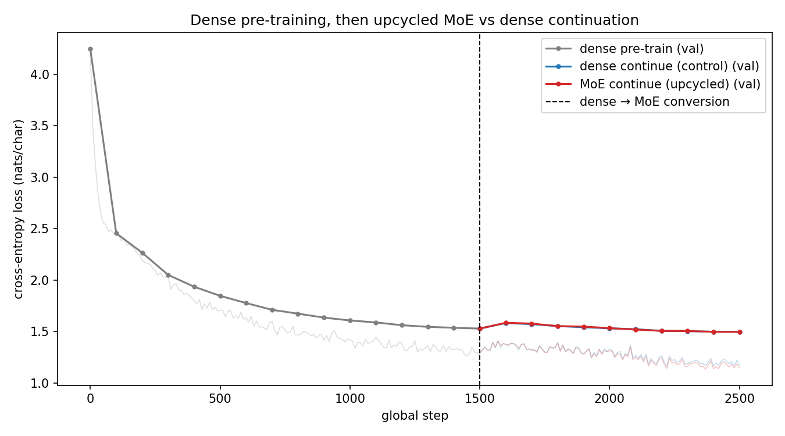
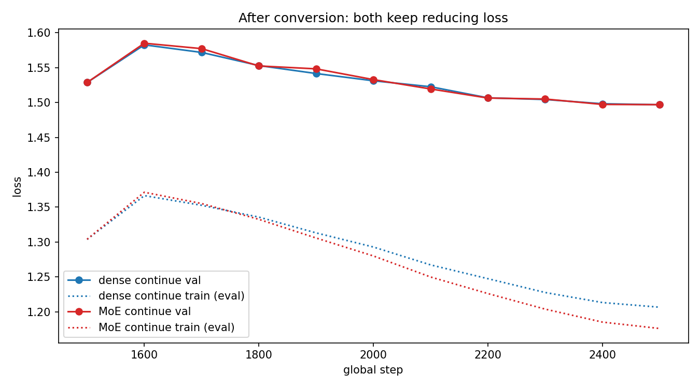
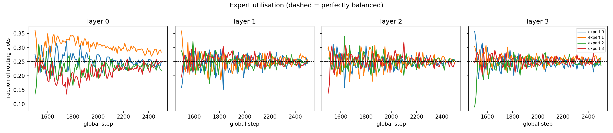
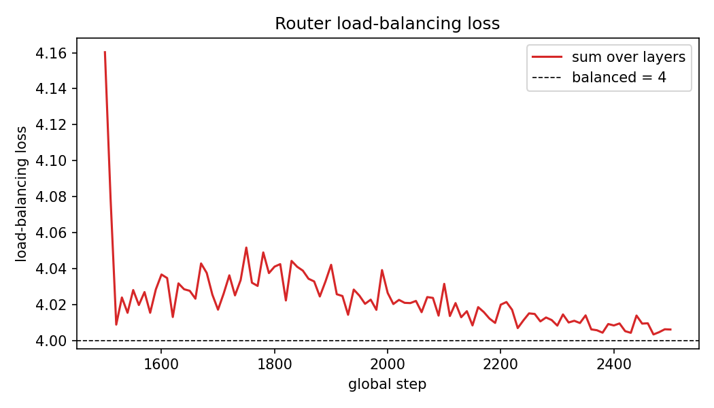

# Dense-to-MoE Upcycling of a Character-Level GPT

**Session 14 — LLM course assignment** | Repository: AditeyaAItronics/llm_finetune_assignments

## 1. Summary

A 3.2 M-parameter dense character-level GPT was trained on Tiny Shakespeare, converted into a 4-expert top-2 Mixture-of-Experts (MoE) by sparse upcycling, and trained further. Both the MoE and a dense control continued to reduce loss after the conversion point. The three headline results are:

1. **Dense pre-training** reduced validation loss from **4.2502 to 1.5286** over 1,500 steps.
2. **The conversion is exact:** the upcycled MoE scores the same validation loss as the dense model it was built from (1.5285756 in both cases; absolute difference 2.98e-08).
3. **The MoE continued to train and reduce loss:** after 1,000 further steps its validation loss is **1.4969**, below the 1.5286 starting point. The dense control reached 1.4967, so on validation loss there is no measurable difference between the two arms.

The assignment requirement — convert a trained dense model into an MoE and show that it continues to train and reduce loss — is therefore met. The complete training logs are listed in [Section 10](#10-training-logs); the MoE continuation log is [`logs/moe_continue.log`](logs/moe_continue.log).

## 2. Interpretation of the task

"Linear model" is interpreted as a dense Transformer whose feed-forward network (FFN) in each block is `Linear → GELU → Linear` ([`src/model.py`](src/model.py), class `MLP`). "Convert into an MoE" means replacing every one of these FFNs with a routed layer of several FFN experts plus a learned router, initialised from the trained dense weights (sparse upcycling, Komatsuzaki et al., 2022), and then continuing training. To separate the effect of the MoE from the effect of simply training for longer, an identical dense continuation run is used as a control.

## 3. Setup

| Item | Value |
|---|---|
| Data | Tiny Shakespeare, [`data/tinyshakespeare.txt`](data/tinyshakespeare.txt): 1,115,394 characters, vocabulary 65 |
| Split | First 90% train (1,003,854 chars), last 10% validation (111,540 chars) |
| Dense model | 4 layers, `d_model` 256, 4 heads, `d_ff` 1024, context 128, learned positional embeddings |
| MoE configuration | 4 experts per layer, top-2 routing, gates renormalised to sum to 1, load-balancing coefficient 0.01 |
| Optimiser | AdamW, betas (0.9, 0.95), weight decay 0.1, gradient clipping 1.0 |
| Stage 1 schedule (dense pre-train) | 1,500 steps, linear warm-up 100 steps to 1e-3, cosine decay to 1e-4 |
| Stage 2 schedule (both continuation arms) | 1,000 steps, linear warm-up 50 steps to 5e-4, cosine decay to 5e-5 |
| Batch | 32 sequences × 128 characters = 4,096 tokens per step |
| Total tokens | 6.14 M (stage 1); 4.10 M per continuation arm (stage 2) |
| Evaluation | Every 100 steps, 20 batches each of train and validation |
| Seed | 1337 (single seed) |
| Hardware | CPU only, 16 threads; Python 3.12.10, PyTorch 2.14.0+cpu, Windows 10 ([`results/environment.txt`](results/environment.txt)) |

## 4. How the conversion works

For a token `x`, the MoE output is `Σ_{e ∈ top-k} g_e · FFN_e(x)`, where the gates `g_e` are the top-2 router probabilities renormalised so that `Σ g_e = 1`.

- Every expert is initialised as an exact copy of the trained dense FFN, so `FFN_e = FFN` for all `e`.
- The output then equals `FFN(x) · Σ g_e = FFN(x)`, whatever the router selects.
- The router can therefore be initialised randomly (normal, standard deviation 0.02) without changing the model's function; this spreads tokens across experts from step 0.
- No noise is added to the expert copies, since that would break function preservation. The experts diverge naturally because each receives gradients only from the tokens routed to it.

Training adds the Switch Transformer load-balancing loss in each layer, `aux = E · Σ_e f_e · P_e`, where `E = 4`, `f_e` is the fraction of routing slots assigned to expert `e`, and `P_e` is the mean router probability for `e`. It equals 1 per layer under perfect balance. The total objective is `CE + 0.01 · Σ_layers aux`.

**Measured evidence of exactness** ([`logs/conversion_check.json`](logs/conversion_check.json)):

| Check | Value |
|---|---|
| Dense validation loss | 1.5285756 |
| Upcycled MoE validation loss | 1.5285756 |
| Absolute difference | 2.98e-08 |
| Maximum logit difference (8 validation sequences) | 7.5e-06 |

Both differences are at the level of float32 rounding. The script asserts a maximum logit difference below 1e-4 before training proceeds.

## 5. Results

| Run | Steps | Val loss start | Val loss end | Drop | Wall time |
|---|---:|---:|---:|---:|---:|
| Dense pre-train | 1500 | 4.2502 | 1.5286 | 2.7217 | 20.6 min |
| Dense continue (control) | 1000 | 1.5286 | 1.4967 | 0.0318 | 8.0 min |
| MoE continue (upcycled) | 1000 | 1.5286 | 1.4969 | 0.0317 | 15.2 min |

Source: [`results/summary.md`](results/summary.md), [`results/summary.json`](results/summary.json).



**Figure 1 — full timeline.** The grey curve shows dense pre-training falling steeply from 4.2502 and flattening towards 1.5286 at global step 1,500. The dashed line marks the conversion. The MoE curve (red) begins exactly where the dense curve ends, with no spike at the conversion point, and thereafter tracks the dense control (blue) closely.



**Figure 2 — after conversion.** Both arms rise during the first ~100 steps (validation 1.5848 for the MoE and 1.5825 for the dense control at global step 1,600) and then fall steadily to 1.4969 and 1.4967 respectively. This rise is caused by the learning-rate schedule, not by the conversion: stage 1 had annealed the learning rate to 1e-4, and stage 2 re-warms it to 5e-4 (with a freshly initialised optimiser). The effect is nearly identical in both arms (peak validation loss 1.5848 for the MoE and 1.5825 for the dense control), the MoE and dense losses are identical at step 0, and the MoE shows no discontinuity at the conversion itself. A lower peak learning rate for the continuation stage would be expected to avoid the transient; this is a sensible next experiment, but it was not run here.

The difference in final validation loss (MoE minus dense) is 0.0001. With a single seed this is well within run-to-run noise and is reported as **no measurable difference on validation loss**. The dotted lines in Figure 2 show the evaluated training loss: the MoE reaches 1.1762 against 1.2067 for the dense control, so its train–validation gap is larger (0.321 against 0.290). The additional expert capacity is therefore mostly being used to fit the 1 MB training corpus rather than to generalise. This is the expected behaviour for a dataset of this size; the advantages of MoE models are expected to appear with substantially more data.

## 6. Are the experts actually used?





Immediately after conversion, routing is uneven (for example, layer 3 expert 2 receives 0.09 of the routing slots at step 0). Within roughly 20 steps the load-balancing loss falls to about 4.01; layers 1–3 then fluctuate around uniform usage, while layer 0 retains a preference for expert 1 that narrows gradually over training. The load-balancing loss, summed over the four layers, starts at 4.1603 and stays close to 4.0 throughout (4.0061 at the final step), where 4 corresponds to perfect balance. No expert collapse occurs.

Final routing fractions (from [`results/summary.json`](results/summary.json), `final_expert_frac`):

| Layer | Expert 0 | Expert 1 | Expert 2 | Expert 3 |
|---|---:|---:|---:|---:|
| 0 | 0.249 | 0.284 | 0.218 | 0.250 |
| 1 | 0.243 | 0.259 | 0.246 | 0.253 |
| 2 | 0.256 | 0.246 | 0.254 | 0.243 |
| 3 | 0.246 | 0.265 | 0.237 | 0.252 |

All fractions lie between 0.218 and 0.284. Layer 0 shows the most persistent preference (expert 1, the most-used at 0.284), while layers 1–3 are close to uniform.

## 7. Parameters and compute

| Quantity | Dense | MoE |
|---|---:|---:|
| Total parameters | 3,225,600 | 9,536,512 |
| Active parameters per token | 3,225,600 | 5,331,968 |
| Wall time, 1,000 continuation steps | 481.6 s | 911.7 s |
| Seconds per step | 0.48 | 0.91 |

The MoE holds four copies of each FFN plus a router, so its total parameter count is roughly three times that of the dense model. With top-2 routing each token passes through two experts, so the active FFN compute per token is twice that of the dense model, and active parameters rise accordingly (total minus the two unused experts per layer). The measured slowdown of approximately 1.9× reflects that doubling the FFN FLOPs alone accounts for less than 2× total compute (attention cost is unchanged), and the remainder of the wall-clock gap comes from the loop-based expert dispatch in [`src/moe.py`](src/moe.py). Any comparison between the arms should be read with this cost in mind: at equal validation loss, the MoE used about 1.9× the wall-clock time.

## 8. Samples

Generated from the prompt `ROMEO:` with temperature 0.8 and the same random seed for each checkpoint ([`results/samples.txt`](results/samples.txt)).

Dense model at step 1,500 (before conversion):

```text
ROMEO:
Why must I swear?

WARWICK:
That you wilt strange of thy heart;
The change of such livers on the lives,
```

Dense control at step 2,500:

```text
ROMEO:
Why moves here, let the deep has wounds to thee,
Is away to have an age his followers:
These is something we were a whipted and death,
The father we would for many of their cheeks the sweet
```

Upcycled MoE at step 2,500:

```text
ROMEO:
Why my sovereign? I would never broke the strength
As we have weeping for this being son.

Shepherd:
'Tis writted and consul, that we need forth.
```

All three samples reproduce the play format (speaker names, verse line lengths, archaic vocabulary). Their qualitative differences are small, which is consistent with the near-identical validation losses.

## 9. Limitations

- **Single seed.** The 0.0001 difference in final validation loss cannot be distinguished from seed variance; multiple seeds would be required for any claim of superiority.
- **Small corpus.** Tiny Shakespeare is about 1 MB. The larger train–validation gap of the MoE indicates that additional capacity tends toward overfitting at this scale.
- **Character-level modelling.** Results may not transfer directly to subword-tokenised language models.
- **CPU-scale model.** The model is deliberately small so that all runs complete on a CPU in under an hour.
- **Loop-based expert dispatch.** Experts are evaluated in a Python loop rather than a fused or batched kernel, which inflates the measured wall time relative to an optimised implementation.
- **Re-warmed learning rate.** The continuation schedule introduces a transient loss increase in both arms (Section 5); a lower continuation peak learning rate was not tested.

## 10. Training logs

**This section addresses the requirement that the repository contain training logs.** Every run writes a human-readable `.log` file (one line every 10 steps, with evaluation every 100 steps) and a machine-readable `.jsonl` file containing the same rows with full precision, token counts and elapsed time.

| Run | Human-readable log | Machine-readable log |
|---|---|---|
| Stage 1: dense pre-training (steps 0–1,500) | [`logs/dense_pretrain.log`](logs/dense_pretrain.log) | [`logs/dense_pretrain.jsonl`](logs/dense_pretrain.jsonl) |
| Stage 2: MoE continuation (global steps 1,500–2,500) | [`logs/moe_continue.log`](logs/moe_continue.log) | [`logs/moe_continue.jsonl`](logs/moe_continue.jsonl) |
| Stage 2: dense continuation, control (global steps 1,500–2,500) | [`logs/dense_continue.log`](logs/dense_continue.log) | [`logs/dense_continue.jsonl`](logs/dense_continue.jsonl) |
| Conversion check | [`logs/conversion_check.json`](logs/conversion_check.json) | — |

Each `.log` file begins with a header line recording the full training and model configuration. The MoE log additionally records the load-balancing loss (`aux`) and the per-layer routing fractions (`experts`). Excerpt from [`logs/moe_continue.log`](logs/moe_continue.log) — the first step and the last two evaluations:

```text
step     0 (global  1500) | lr 0.00e+00 | train_ce 1.2912 | aux 4.1603 | EVAL train 1.3039 val 1.5286 | experts [0.27,0.36,0.14,0.23] [0.16,0.36,0.29,0.20] [0.30,0.30,0.26,0.14] [0.36,0.30,0.09,0.25]
...
step   900 (global  2400) | lr 6.24e-05 | train_ce 1.1371 | aux 4.0083 | EVAL train 1.1854 val 1.4972 | experts [0.26,0.28,0.24,0.22] [0.26,0.26,0.24,0.25] [0.24,0.26,0.25,0.25] [0.25,0.27,0.24,0.25]
step  1000 (global  2500) | lr 5.00e-05 | train_ce 1.1477 | aux 4.0061 | EVAL train 1.1762 val 1.4969 | experts [0.25,0.28,0.22,0.25] [0.24,0.26,0.25,0.25] [0.26,0.25,0.25,0.24] [0.25,0.27,0.24,0.25]
```

The validation loss falls from 1.5286 at the conversion to 1.4969 at the end of training.

## 11. Reproduce

From the `moe-upcycling-14/` directory:

```bash
pip install -r requirements.txt
python -m pytest -v
python experiments/exp1_pretrain_dense.py
python experiments/exp2_continue.py --arch moe
python experiments/exp2_continue.py --arch dense
python experiments/exp3_report.py
```

The first experiment writes `checkpoints/dense.pt`, which both continuation runs load. Checkpoints are not committed to the repository; the logs, figures and summaries are.

## 12. File map

- `README.md` — this report.
- `plan.md` — implementation plan and design rationale.
- `requirements.txt` — Python dependencies.
- `data/tinyshakespeare.txt` — training corpus (committed so that runs work offline).
- `src/data.py` — character-level dataset, train/validation split and batch sampling.
- `src/model.py` — dense GPT; the `MLP` FFN is the component replaced by the MoE.
- `src/moe.py` — top-k MoE layer, load-balancing loss and the `upcycle` conversion function.
- `src/train.py` — training loop, learning-rate schedule, evaluation and logging.
- `src/seeding.py` — deterministic seeding.
- `experiments/exp1_pretrain_dense.py` — stage 1: dense pre-training.
- `experiments/exp2_continue.py` — stage 2: MoE or dense continuation, including the conversion check.
- `experiments/exp3_report.py` — figures, summary tables and text samples.
- `tests/` — unit tests for data, model, MoE, upcycling and training.
- `logs/` — all training logs (Section 10).
- `results/` — figures, `summary.json`, `summary.md`, `samples.txt`, `environment.txt`.
